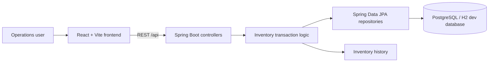
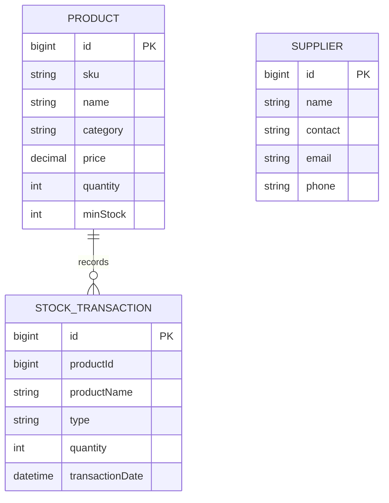

# RIMS Architecture

```mermaid
flowchart LR
  U[Operations user] --> F[React + Vite frontend]
  F -->|REST /api| C[Spring Boot controllers]
  C --> S[Inventory transaction logic]
  S --> R[Spring Data JPA repositories]
  R --> D[(PostgreSQL / H2 dev database)]
  S --> H[Inventory history]
```

```mermaid
erDiagram
  PRODUCT { bigint id PK string sku string name string category decimal price int quantity int minStock }
  SUPPLIER { bigint id PK string name string contact string email string phone }
  STOCK_TRANSACTION { bigint id PK bigint productId string productName string type int quantity datetime transactionDate }
  PRODUCT ||--o{ STOCK_TRANSACTION : records
```
